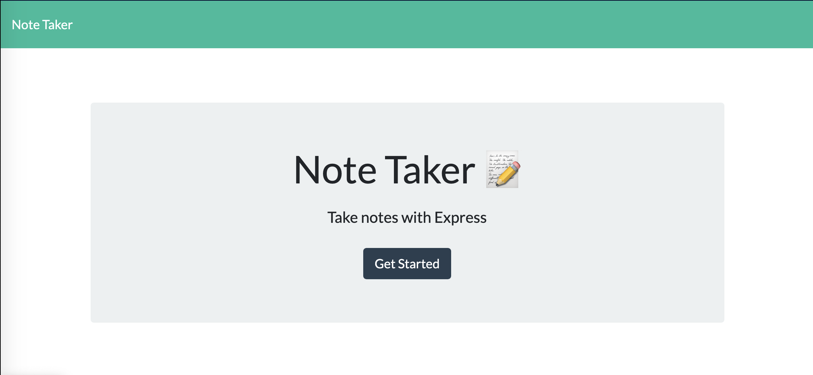
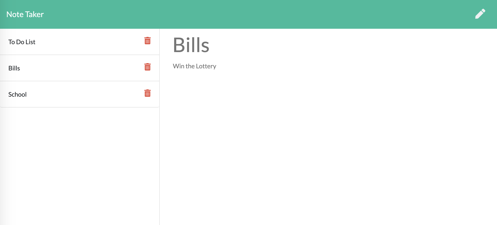

# Note Taker

Description
---
This application that can be used to write, save, and delete notes. This application uses an express backend that saves and retrieves note data from a JSON file.

How To Use:
---
Click the Get Started button to see the notes already saved.

Click in the Note Title area to create a note title and then type the note. Click the save button in the top right corner to save the note.

Click the desired note on the lefthand side to see the note populated in the text area.

The trash icon will delete a note from the server.

Built With
--
* Express.js
* Node.js
* JavaScript
* HTML

MIT License

Copyright (c) 2020 Sharon Yelverton

Permission is hereby granted, free of charge, to any person obtaining a copy of this software and associated documentation files (the "Software"), to deal in the Software without restriction, including without limitation the rights to use, copy, modify, merge, publish, distribute, sublicense, and/or sell copies of the Software, and to permit persons to whom the Software is furnished to do so, subject to the following conditions:

The above copyright notice and this permission notice shall be included in all copies or substantial portions of the Software.

THE SOFTWARE IS PROVIDED "AS IS", WITHOUT WARRANTY OF ANY KIND, EXPRESS OR IMPLIED, INCLUDING BUT NOT LIMITED TO THE WARRANTIES OF MERCHANTABILITY, FITNESS FOR A PARTICULAR PURPOSE AND NONINFRINGEMENT. IN NO EVENT SHALL THE AUTHORS OR COPYRIGHT HOLDERS BE LIABLE FOR ANY CLAIM, DAMAGES OR OTHER LIABILITY, WHETHER IN AN ACTION OF CONTRACT, TORT OR OTHERWISE, ARISING FROM, OUT OF OR IN CONNECTION WITH THE SOFTWARE OR THE USE OR OTHER DEALINGS IN THE SOFTWARE.
